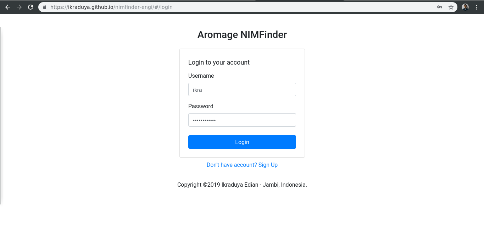
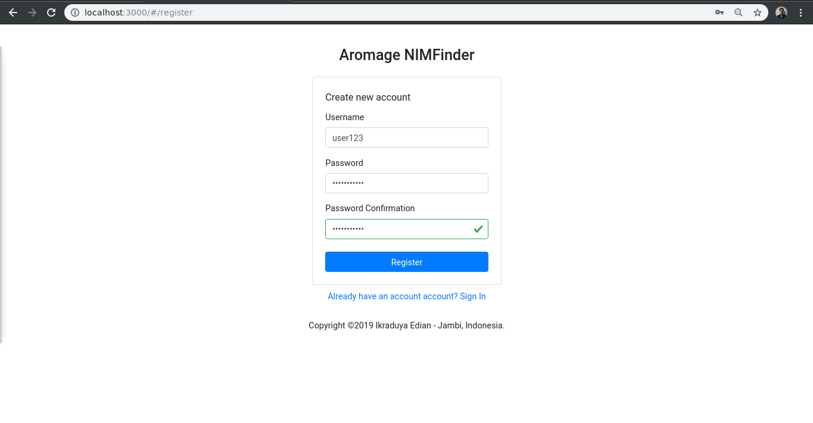
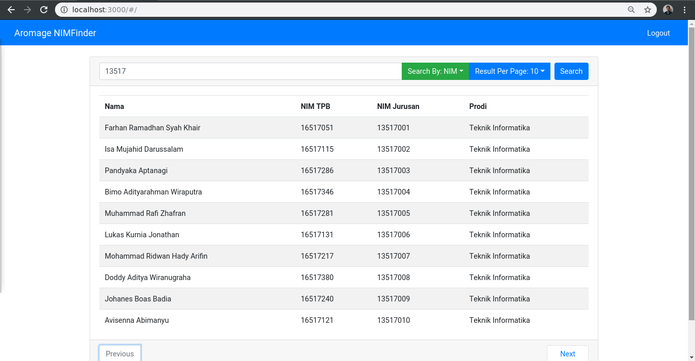

# Aromage NIMFinder
Nama: Ikraduya Edian  
NIM: 13517106

# Cara Menjalankan
## Running Development build
```shell
npm start
```

## Build
```shell
npm run build
```

## Deploy to Github Pages
```shell
npm run deploy
```

# Cara Menggunakan
1. Pergi ke *homepage*  
http://localhost:3000/#/ untuk development  
https://ikraduya.github.io/nimfinder-engi/#/ untuk production 

2. Apabila belum pernah login, Anda otomatis diarahkan menuju halaman login  
http://localhost:3000/#/login untuk development  
https://ikraduya.github.io/nimfinder-engi/#/login untuk production  
Jika sudah login, langsung ke langkah 6

3. Di halaman login, masukkan username dan password yang telah terdaftar

Kemudian klik "**Login**". Apabila berhasil, Anda akan diarahkan ke *homepage*

4. Apabila belum mendaftar, klik tulisan "**Don't have account? Sign Up**"  
Anda akan diarahkan menuju halaman pendaftaran

5. Di halaman pendaftaran, masukkan username, password, dan konfirmasi password

Kemudian klik "**Register**". Apabila berhasil, anda akan diarahkan menuju halaman login

6. Berikut tampilan awal *Homepage*

Masukkan query di search bar.  
Pilih parameter "**Search by**" yang diinginkan (NIM atau Nama)  
Pilih parameter "**Result Per Page**" yang diinginkan (10, 25, 50, 100)  
Terakhir klik tombol "**Search**" atau tekan *enter* untuk melakukan pencarian.

    Tampilan hasil pencarian per halaman dibatasi oleh parameter "**Result Per Page**". Anda dapat meng-klik tombol "**Previous**" atau "**Next**" untuk berpindah halaman

# Desain Aplikasi
## Struktur Aplikasi
```
aromage-nimfinder
├── package.json
├── .gitignore
├── public/
│   ├── favicon.ico
│   ├── index.html
│   └── manifest.json
└── src/
    ├── commons/
    │   ├── Footer/
    │   │   └── index.js
    │   ├── Header/
    │   │   └── index.js
    │   └── Layout/
    │       └── index.js
    ├── components/
    │   ├── Home/
    │   │   └── index.js
    │   ├── Login/
    │   │   └── index.js
    │   └── Register/
    │       └── index.js
    ├── App.css
    ├── App.js
    ├── App.test.js
    ├── index.css
    ├── index.js
    └── serviceWorker.js
```
Penjelasan:
- commons = kelas-kelas komponen yang *common* (umum)
- components = kelas-kelas komponen halaman

## Kelas Komponen
Aromage NIMFinder terdiri dari enam kelas komponen. Tiga di folder common dan tiga di folder components. Semua diturunkan dari *React.PureComponent*.
### Footer
Kelas ini berisi footer ditampilkan di seluruh halaman aplikasi
### Header
Kelas ini berisi header yang ditampilkan di seluruh halaman aplikasi, kecuali halaman autentikasi (*login* dan *register*)
### Layout
Kelas ini berfungsi sebagai layout halaman. Menentukan apakah layout memerlukan header atau tidak.
### Home
Kelas ini merupakan halaman tempat pencarian data mahasiswa.
### Login
Kelas ini berfungsi untuk autentikasi login.
### Register
Kelas ini berfungsi untuk autentikasi registrasi.

## Bagaimana Aplikasi Bekerja
Ketika aplikasi dijalankan menggunakan `npm start` atau dari hasil build, index.js pada root akan terpanggil dan merender App.js.  
Di dalam App.js terdapat routing yang akan menampilkan halaman sesuai dengan path yang diberikan.

## Design Pattern
Aplikasi ini menerapkan **Decorator Design Pattern**, yaitu dengan digunakannya high order component. Terlihat di App.js terdapat digunakannya kelas Layout sebagai high order component.


# Kakas
- [axios](https://github.com/axios/axios) - Promise based HTTP Client
- [bootstrap](https://getbootstrap.com/) - Free and open-source front-end framework for designing websites and web applications
- [reactstrap](https://github.com/reactstrap/reactstrap) - React Bootstrap 4 components
- [gh-pages](https://github.com/tschaub/gh-pages) - General purpose task for publishing files to a gh-pages branch on GitHub
- [react-cookie](https://github.com/reactivestack/cookies) - Universal cookies for React
- [react-router-dom](https://github.com/ReactTraining/react-router) - DOM bindings for React Router
- [react-fontawesome](https://github.com/FortAwesome/react-fontawesome) - A React component for the font-awesome icon library
- [sweetalert2](https://github.com/sweetalert2/sweetalert2) - Beautiful, responsive, customizable, accessible (WAI-ARIA) replacement for JavaScript's popup boxes

# Review terhadap desain API
## Paginasi
API belum sempurna dalam mengimplementasikan paginasi karena tidak mengirimkan data jumlah page ataupun atau hasil seluruh query pada response endpoint **/byid** dan **/byname**

Harusnya dapat dikirimkan juga data jumlah page agar paginasi dapat dinomori.
## Sort by
Setelah mengobservasi, API selalu mengurutkan hasil query berdasarkan NIM Jurusan. Pengguna API kurang dapat mengatur hasil query, karena tidak disediakan sarana 'Sort by'

Harusnya dapat disediakan parameter sortBy agar hasil query dapat diatur.
## Header Cookie untuk Login
Sebelum direvisi, API membutuhkan token di header Cookie untuk melakukan login. Hal ini tidak memungkinkan karena header 'Cookie' termasuk header yang dilarang untuk diset secara manual oleh browser.
## Response tanpa Allow-Control-Allow-Origin
Sebelum direvisi, API tidak mencantumkan header Allow-Control-Allow-Origin di setiap response yang mana browser tidak mengizinkan untuk menerima response semacam itu dikarenakan cors policy.
